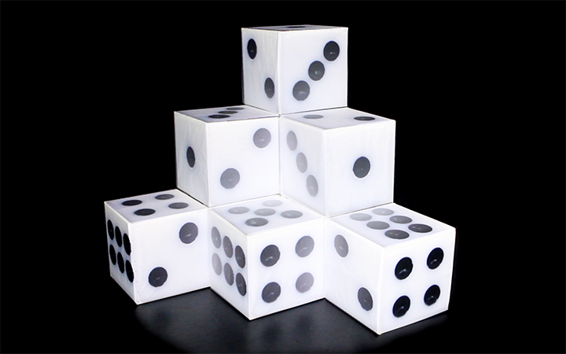

# dicing_projectionMapping

Watch demo video via Vimeo: https://vimeo.com/316445650

Projection-mapped on a three-layer structured cubes pyramid, DICING is a generative art piece that showing a dynamic world of dices, which explores the possible variations of just the simple circle shapes. The scene starts with the appearance of a pile of dices, then following an order of one to six, it shows minimalist black and white animations generated from the number of dots on a dice.

Project created during my MA at Goldsmiths Computational Arts.

* Addon required: ofxPiMapper
